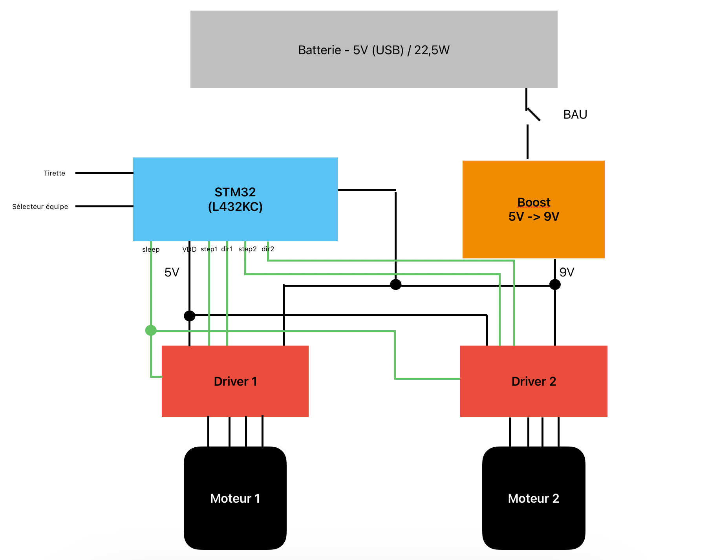

# Analyse du règlement et conception - PAMIs

## Documents de conception

### Carte principale

La carte utilisée est une Nucleo L432KC. 
- [pinout de la carte](https://os.mbed.com/platforms/ST-Nucleo-L432KC/) (site MBED)
- [utilisation des pins pour les PAMIs](https://docs.google.com/spreadsheets/d/1nnAxQa-xgVzteT0e-WYy9qsg8co_bPJd0W1cznvzzPQ/edit?usp=sharing) (éditable) 

### Schéma électronique

### Liste des composants

La taille de la plupart de ces composants peut être trouvée dans [ce document](./composants.csv).

- carte Nucleo L432KC
- Batterie externe de téléphone (5V, 22.5W)
- 2 $\times$ Moteurs pas à pas NEMA-17 20mm d'épaisseur (13 N.cm)
- Buck boost (ref exacte ???)
- 2 $\times$ drivers moteur A4988
- 2 $\times$ roues (diamètre : ???)
- Bouton d'arrêt d'urgence
- Tirette 
- Sélecteur d'équipe (interrupteur)

## Liens utiles 

- [librairie Arduino StepperDriver](https://github.com/laurb9/StepperDriver/) (compatible avec le A4988)

Pour toute question aller sur [le salon PAMI du discord](https://discord.gg/RnYkBRJE7z).

## Documents archivés 

- [liste des contraintes](./Contraintes%20PAMIs.pdf) ([version éditable](https://docs.google.com/drawings/d/1aNA5bNJc2DdUMf7WPIdK8QOshezXf-j2Hv97i4UfBy4/edit?usp=sharing))
- liste des points possibles (pas fini)
- [spreadsheet des idées](https://docs.google.com/spreadsheets/d/1GuigQY19NkE2jPr05z4DLiZ8AFi4P-pAyoT_fMEKkbg/edit?usp=sharing) (inutile maintenant)
